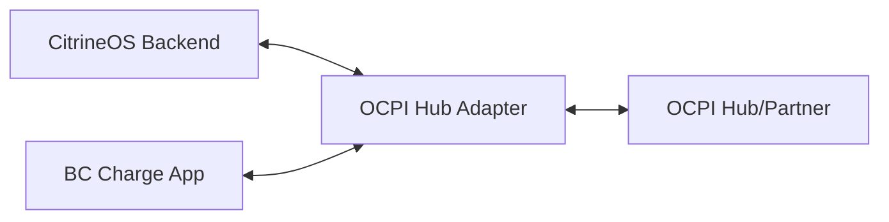

# OCPI 2.2.1 Specification for BC Charge (Roaming Integration)

## 1. Overview
This document defines the internal mapping and requirements for BC Charge's integration with OCPI 2.2.1 to enable roaming (EMP/CPO interoperability).

## 2. Functional Scope
BC Charge acts as both a **CPO** (Charge Point Operator - providing chargers) and an **EMP** (E-Mobility Provider - providing the app/user account).

### Core Modules
| Module | Direction | Purpose |
|--------|-----------|---------|
| **Locations** | CPO $\rightarrow$ EMP | Sync charger locations, status, and technical specs. |
| **Tariffs** | CPO $\rightarrow$ EMP | Sync current pricing (inc. dynamic pricing) for roaming users. |
| **Sessions** | CPO $\leftrightarrow$ EMP | Start/Stop sessions and share real-time consumption data. |
| **CDRs** | CPO $\rightarrow$ EMP | Charge Detail Records for billing settlement. |
| **Tokens** | EMP $\rightarrow$ CPO | Validate user RFID/App IDs for authorization. |

## 3. Technical Mapping (CitrineOS $\leftrightarrow$ OCPI)

### 3.1 Locations (CPO View)
- **CitrineOS `Station`** $\rightarrow$ **OCPI `Location`**
- **CitrineOS `Connector`** $\rightarrow$ **OCPI `EVSE`**
- **Dynamic Pricing** $\rightarrow$ Mapped to `Tariff` module with time-interval overrides.

### 3.2 Tariffs
- **Base Price** $\rightarrow$ `price`
- **Dynamic Multiplier** $\rightarrow$ mapped to `tariff` entries with specific `validFrom` and `validTo` timestamps.
- **Currency** $\rightarrow$ `currency` (EUR).

### 3.3 Sessions
- **OCPP Transaction** $\rightarrow$ **OCPI Session**
- **Real-time Meter Values** $\rightarrow$ `SessionProperties` (energy delivered).

## 4. Integration Architecture
The `bc-charge-app` will interact with a **Roaming Hub Adapter** (initially mocked, later CitrineOS OCPI-Bridge or Hubject).

## 5. Implementation Phases
1. **Phase 2.1 (Current):** Mock OCPI Hub Adapter in `src/api/ocpi`.
2. **Phase 2.2:** Integration of `Locations` and `Tariffs` (Read-only).
3. **Phase 2.3:** Integration of `Sessions` and `Tokens` (Read-Write).
4. **Phase 2.4:** CDR settlement logic.
